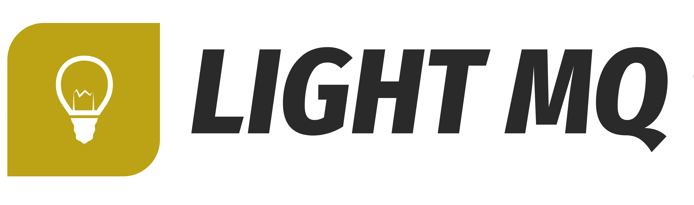

Will be an "Open source gRPC-protocol message broker written in Go". Aims to be easy-to-use, lightweight and persistent.

---

# Light MQ

Publish-subscribe system that can deliver in-order, persistent messages.

## Key features 
* Lightweight, fast, and compact.
* Persistent. All messages stored in log-like way. (Could be used as Event Store)
* Client-free. Use gRPC-generated code to connect.

## Main concepts
* Uses push-based approach for subscribers.
* Stores messages in entities called topics. 
* Every subscriber belongs to a group where each message only consumed by a single member. 

